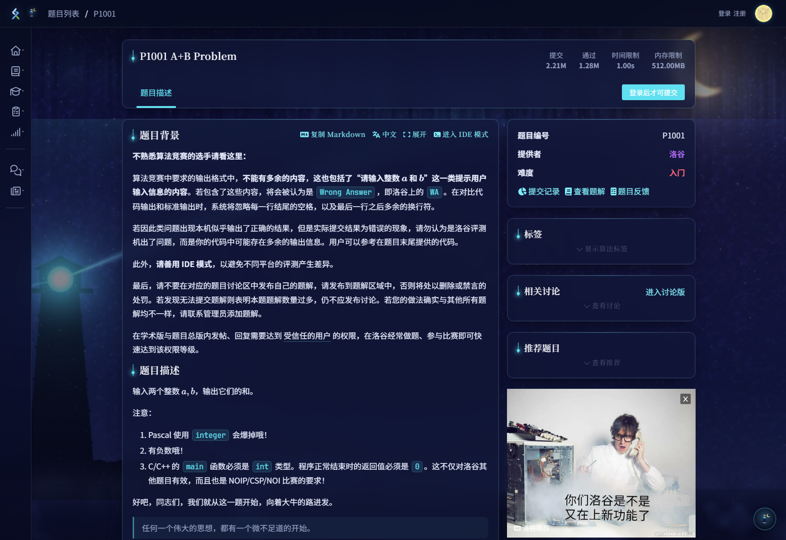
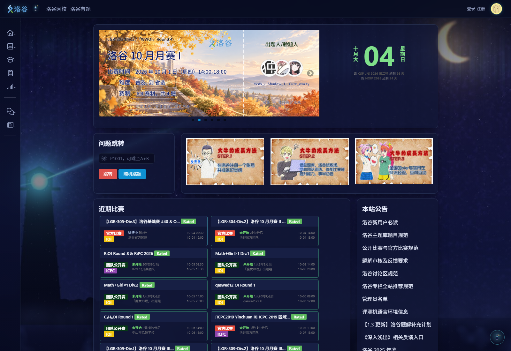
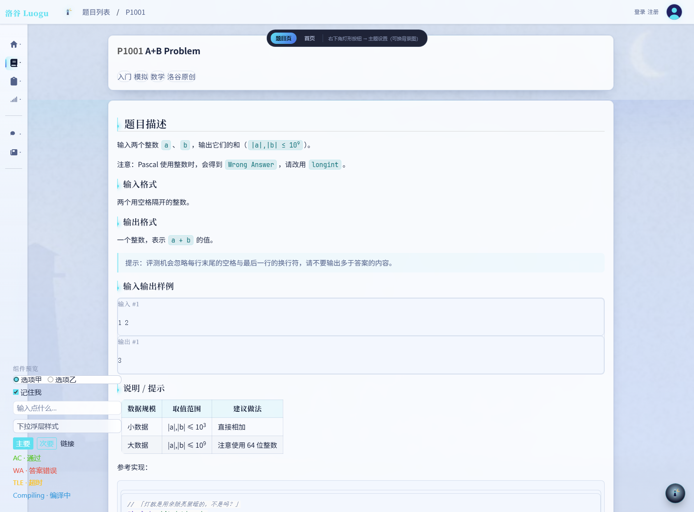
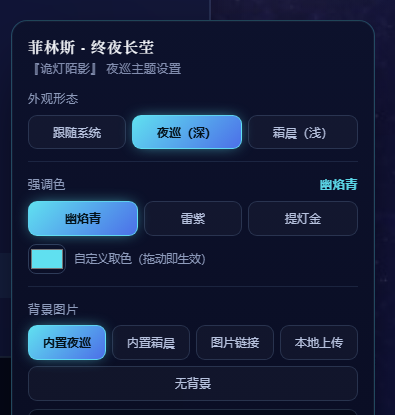

# 洛谷 · 菲林斯主题「终夜长茔」

> 给 [洛谷](https://www.luogu.com.cn/) 做的一套《原神》菲林斯（Flins）主题。
> 深靛蓝夜色 + 提灯冷蓝焰 + 金色新月 + 灯塔剪影。
> **背景图片可以随时换** —— 内置插画 / 图片直链 / 拖本地文件，三种都行。

[](LICENSE)
[](https://raw.githubusercontent.com/liumingyangrd/luogu_flins_theme/main/dist/flins.user.js)
[](dist/flins-extension)
[](https://github.com/liumingyangrd/luogu_flins_theme/releases)

**在真实的 luogu.com.cn 上截图，不是离线预览：**





| 霜晨（浅色） | 设置面板 |
|---|---|
|  |  |

---

## 目录

- [特性](#特性)
- [安装](#安装)
- [换背景图片](#换背景图片)
- [设置面板](#设置面板)
- [已验证页面](#已验证页面)
- [目录结构](#目录结构)
- [本地开发](#本地开发)
- [常见问题](#常见问题)
- [已知限制](#已知限制)
- [配色依据](#配色依据)
- [参与贡献](#参与贡献)
- [授权与免责](#授权与免责)

---

## 特性

- **四种安装方式**：油猴脚本 / Chrome·Edge 扩展（MV3）/ 纯 CSS（Stylus）/ 洛谷官方主题格式，
  前两者功能最全，官方主题方式不用装任何东西。
- **底色跟洛谷语义令牌走**：改动同时驱动 `--lcolor--primary`、`--lcolor--link` 等，
  按钮、链接、选中态一起变色，而不是硬盖一层皮。
- **两套形态**：夜巡（深）/ 霜晨（浅），可跟随系统。
- **三种强调色**：幽焰青 / 雷紫 / 提灯金，也能自己取色。
- **背景图片 6 种来源 + 6 个参数**（模糊 / 明暗 / 缩放 / 蒙版浓度 / 对齐 / 平铺）。
- **白块自愈**：洛谷把不少背景硬编码成 `#fff`，面板里可「扫描并修复」，
  并把修了什么复制到剪贴板；自动模式默认开启。
- **毛玻璃 / 装饰 / 动效**可单独关闭，尊重系统「减弱动态效果」与洛谷自己的低端机降级。
- **配置可导出**：面板底部「复制配置」输出一段 JSON，方便备份或分享。
- **带一套真站验证工具**：CDP 注入诊断、白块审计、按坐标查「到底是谁给它上的色」。
- **零依赖、零遥测**：脚本里没有任何 `fetch` / `XMLHttpRequest` / `sendBeacon` / `WebSocket`
  调用（可自行 `grep` 验证），设置只写进油猴存储或 `localStorage`。

---

## 安装

四条路任选一条。**A 与 D 可以叠加**（官方主题负责「底」，脚本负责「面」）。

### A. 油猴脚本（推荐）

1. 浏览器装 [Tampermonkey](https://www.tampermonkey.net/)（Violentmonkey / ScriptCat 也行）。
2. 点这个链接安装：[`dist/flins.user.js`](https://raw.githubusercontent.com/liumingyangrd/luogu_flins_theme/main/dist/flins.user.js)，
   或把仓库里的 `dist/flins.user.js` 直接拖进浏览器窗口，按提示安装。
3. 打开任意洛谷页面。右下角会出现一个**灯形按钮**，点开就是设置面板。

脚本自带「夜巡」背景插画（已内嵌，约 427 KB），装完即用，不需要额外配置。

### B. Chrome / Edge 扩展（不想装油猴）

1. 地址栏打开 `chrome://extensions`（Edge 是 `edge://extensions`）。
2. 右上角打开「**开发者模式**」。
3. 点「**加载已解压的扩展程序**」，选仓库里的 `dist/flins-extension` 文件夹。

> ⚠️ **Edge 上这条路的已知问题**：Edge 重启后经常会弹一条「停用开发人员模式扩展程序」，
> 一旦生效扩展就会被关掉，主题随之消失。这不是本主题的 bug，是 Edge 对
> 「开发者模式加载的扩展」的既定行为。
>
> 判断方法：`edge://extensions` 里看本扩展的开关是不是被关掉了。
> 修复方法：把开关重新打开 → 刷新洛谷页面。
>
> **嫌麻烦就直接用 A（油猴）** —— 油猴是从 Edge 加载项商店装的，属于正规扩展，不会遇到这个问题。

### C. Stylus（纯 CSS，不跑脚本）

1. 装 [Stylus](https://add0n.com/stylus.html)。
2. 新建样式 → 作用域填 `luogu.com.cn` → 把 `dist/flins.css` 全文粘进去。

纯 CSS 方式下默认是**深色「夜巡」**、**不带背景图**（图片没法内嵌进样式表）。要背景图，
改样式开头的 `--flins-bg-image`：

```css
:root {
  --flins-bg-image: url("https://cdn.luogu.com.cn/upload/image_hosting/xxxx.jpg");
}
```

### D. 洛谷官方主题系统（不用装任何东西）

洛谷自带主题商店（<https://www.luogu.com.cn/theme>）。`theme/` 目录里有两份**官方格式**的
主题 JSON，按 [`theme/README.md`](theme/README.md) 的字段对照表填进编辑器即可。
功能比脚本少（只能改背景图、顶栏与底色、毛玻璃），但胜在是原生机制、跨设备同步。

---

## 换背景图片

这是这套主题做得最重的一块。点右下角灯形按钮 → **背景图片**，有 6 个来源可选：

| 选项 | 说明 |
|---|---|
| **跟随形态**（默认） | 深色配「夜巡」插画，浅色配「霜晨」插画，自动切换 |
| **内置夜巡** | 内嵌的夜景插画（深靛蓝夜空 + 紫青极光 + 金色新月 + 灯塔光束 + 落雪） |
| **内置霜晨** | 内嵌的冷白霜晨插画 |
| **图片链接** | 粘贴任意图片直链（洛谷图床、其他图床都行） |
| **本地上传** | **直接把图片拖进面板**，或点击选择文件；自动压到 2560px 内再存 |
| **无背景** | 纯色底，回到最素的形态 |

选中「图片链接」或「本地上传」后，下面这几个滑条立刻生效：

| 控件 | 范围 | 作用 |
|---|---|---|
| 模糊 | 0–24px | 背景图高斯模糊（缩放在背后自动补足，不会露边） |
| 明暗 | 0.30–1.80× | 背景图亮度，图太亮压暗、太暗提亮 |
| 缩放 | 1.00–1.80× | 放大背景图，方便把画面重心挪出内容区 |
| 蒙版浓度 | 0–95% | 盖在背景图上的夜色蒙版浓度，越高文字越清楚 |
| 对齐 | 居中/顶部/底部/靠左/靠右 | `background-position` |
| 平铺 | 铺满/完整显示/原始平铺 | `background-size` + `background-repeat` |

**本地上传的图片只存在你自己的浏览器里**（`localStorage`），不会上传到任何服务器。

> 用纯 CSS（Stylus）的话，这些旋钮等价于文件开头的 `--flins-bg-*` 变量，直接改变量即可。

---

## 设置面板

除了背景图片，面板里还能调：

- **外观形态** —— 跟随系统 / 夜巡（深）/ 霜晨（浅）
- **强调色** —— 幽焰青（默认）/ 雷紫 / 提灯金，或自己取色
- **效果开关** —— 毛玻璃、装饰元素（徽记 / 极光扫带 / 页脚铭牌）、动效（灯火呼吸、
  选中脉动；跟随系统「减弱动态效果」）、**自动修补遗漏的白块**
- **标题小灯** —— 标题左边那个发光的小标记，可在「灯芯 / 新月 / 无」之间换。
  颜色跟着深浅形态走：深色用亮青（灯火感），浅色自动换成深青，否则白底上是一团看不见的淡色。
- **漏网的白块** —— 一个「扫描并修复」按钮。洛谷把不少背景色硬编码成 `#fff`，其中一些页面
  （私信、犇犇、登录后才出现的翻页条）**未登录根本看不到**，没法提前枚举。这个按钮当场扫出并
  修掉，同时把「修了什么」复制到剪贴板。自动模式默认开着。

油猴菜单里还有三个快捷项：打开设置、切换深浅、恢复默认。

---

## 已验证页面

白块审计（扫描整页「接近白色的可见背景」）在真实站点上的结果，**深色形态、未登录**：

| 页面 | 白块数 |
|---|---|
| 首页 `/` | 0 |
| 题目列表 `/problem/list` | 0 |
| 题目详情 `/problem/P1001` | 0 |
| 评测记录 `/record/list` | 0 |
| 讨论区 `/discuss` | 0 |
| 个人主页 `/user/1` | 0 |
| 主题商店 `/theme` | 1（取色器的白色色块，本来就该是白的） |

> 审计只看「接近白色」，所以**浅色形态下会大量命中，那是正常的**，请只在深色态用它。
> 复现命令见 [本地开发](#本地开发)。

---

## 目录结构

```
luogu-flins-theme/
├─ dist/                        ← 要用的东西都在这里（成品）
│  ├─ flins.user.js             油猴脚本（约 427 KB，样式表 + 背景图 + 徽记全部内嵌）
│  ├─ flins-extension/          Chrome / Edge 扩展（MV3，免油猴）
│  │  ├─ manifest.json
│  │  ├─ content.js             与 flins.user.js 同一份脚本
│  │  └─ icons/
│  ├─ flins.css                 等价的纯 CSS（Stylus 用，约 154 KB）
│  ├─ flins-emblem.svg          「誓灯」徽记
│  └─ assets/                   可直接上传到洛谷图床的完整尺寸背景图
├─ src/                         ← 源码（构建输入）
│  ├─ flins.css                 主题主样式表（含全部组件重塑与装饰）
│  ├─ _tokens.generated.css     洛谷令牌 + 工具类重写（由脚本生成，勿手改）
│  └─ userscript.js             油猴脚本源码（含 @@ 注入标记）
├─ assets/                      ← 构建输入：背景图、徽记与扩展图标源文件
├─ theme/                       洛谷官方主题格式
│  ├─ flins-night.json / flins-frost.json
│  └─ README.md                 字段对照表
├─ preview/                     离线预览（直接加载 dist/flins.user.js）
│  ├─ index.html
│  ├─ vue-attrs.json            class → data-v-* 对照
│  └─ vendor/                   抓下来的洛谷真实样式快照（见下方说明）
├─ tools/                       构建与验证工具链
│  ├─ build.mjs                 构建 dist/ 与扩展（含语法自检）
│  ├─ make_backgrounds.py       程序化生成背景图
│  ├─ make_tokens.py            生成令牌覆盖 + 工具类重写
│  ├─ live-check.mjs            ★ 真站验证（CDP 注入 + 诊断 + 白块审计 + 按坐标查元素）
│  ├─ verify.mjs                布局验证（侧栏 / 信息栏 / 主栏宽度）
│  ├─ check-extension.mjs       把扩展真装进 Chrome/Edge 验证
│  ├─ check-installed.mjs       读浏览器配置：扩展装没装上、有没有被禁用
│  └─ extract-vue-attrs.mjs     从洛谷页面快照抽 data-v-* 映射
├─ docs/                        截图与验证笔记
│  └─ 开发与验证笔记.md          真站验证的完整记录（原始 README，保留备查）
├─ README.md
├─ CONTRIBUTING.md
└─ LICENSE
```

> `preview/vendor/` 是**洛谷线上样式表的快照**（`luogu3.css`、`oldfe.css`、
> `markdown-palettes.css`、`luogu-root.css`、`amazeui.css` 等），仅用于离线复现布局，
> 版权归洛谷 / 各原作者所有，不属于本项目的 MIT 授权范围。不需要离线预览的话可以整个删掉。

---

## 本地开发

需要 Python 3（Pillow、numpy）和 Node 18+。

```bash
# 1. 重新生成背景图（改 tools/make_backgrounds.py 顶部的调色板 / 构图参数）
python tools/make_backgrounds.py

# 2. 重新生成洛谷配色令牌（改 tools/make_tokens.py 里的 FAMILIES / SEMANTIC）
python tools/make_tokens.py

# 3. 构建 dist/（同时自增 @version 与 manifest version）
node tools/build.mjs
```

只想微调主题本身，改 `src/flins.css` 顶部的「0. 主题参数」一节就够了 —— 色板、圆角、字体、
背景变量全在那儿。改完跑一次 `node tools/build.mjs`。

### 看效果：离线预览

预览页加载的是**洛谷真实的样式快照** + **真实的前端结构** + **真正要安装的
`dist/flins.user.js`**，所以看到的效果和装到线上基本一致。

```bash
python -m http.server 8231
# 打开 http://127.0.0.1:8231/preview/index.html
```

URL 参数（方便截图和排查）：

| 参数 | 说明 |
|---|---|
| `?mode=dark\|light` | 强制深浅形态 |
| `?view=problem\|home` | 切页面 |
| `?accent=ghost\|volt\|lamp` | 强调色 |
| `?bg=auto\|builtin-dark\|builtin-light\|url\|upload\|none` | 背景来源 |
| `?blur=16&scrim=30&zoom=1.2` | 背景参数 |
| `?panel=1` | 自动展开设置面板 |
| `?debug=1` | 给背景相关图层描边 |

> 预览页必须有 HTTP 服务（`file://` 下 `localStorage` 不可用，主题设置存不下来）。

### 在真站上验证

**离线预览不算验证。** 预览页里 DOM 一早就建好了，而油猴 / 扩展注入脚本是在
`@run-at document-start` —— 那时 `document.head` 和 `document.documentElement` **都还是
null**。这个差别足以让脚本在真站上一行都不执行（本项目第一版就栽在这里）。

所以 `tools/live-check.mjs` 直接用 **CDP（Chrome DevTools 协议）** 驱动真实 Chrome，
用 `Page.addScriptToEvaluateOnNewDocument` 在 document-start 注入 `dist/flins.user.js`
—— 这与油猴的注入时机等价，然后回报诊断信息、截图、并做白块审计。

```bash
# 基本诊断 + 截图
node tools/live-check.mjs https://www.luogu.com.cn/problem/P1001

# 多页 + 白块审计（深色态才有意义）
FLINS_AUDIT=1 node tools/live-check.mjs \
  https://www.luogu.com.cn/ \
  https://www.luogu.com.cn/problem/list \
  https://www.luogu.com.cn/record/list

# 强制浅色形态
FLINS_MODE=light node tools/live-check.mjs https://www.luogu.com.cn/

# 想知道某条规则是谁给它上的色（按选择器 / 按坐标）
FLINS_WHY="code.language-cpp" node tools/live-check.mjs https://www.luogu.com.cn/problem/P1001
FLINS_AT="1000,1075" node tools/live-check.mjs https://www.luogu.com.cn/problem/P1001
```

诊断会回报：是否注入（`themeCssPresent`）、`<html>` 上的形态类、关键变量的计算值、
FAB / 面板是否挂上、以及 `window.onerror` 捕获到的异常列表（**真站上应为空数组**）。

更细的排查手法、跨域样式表的坑、以及「未登录看不到的页面怎么审计」，
都记在 [`docs/开发与验证笔记.md`](docs/开发与验证笔记.md)。

> ⚠️ **不要用 PowerShell 的 `Get-Content` / `Set-Content` 去改这些源码。**
> Windows PowerShell 5.1 默认按 ANSI（GBK）读文件，而 `Set-Content -Encoding utf8` 又会写出
> 带 BOM 的 UTF-8 —— 往返一次，文件里所有中文注释和 `content: "…"` 全部变成乱码。
> 要改文本就用编辑器，或者在脚本里显式指定：`Get-Content -Encoding utf8` / `Set-Content -NoNewline`。

---

## 常见问题

**Q：装完刷新了，页面一点没变？**
按顺序排查：① 确认油猴里脚本是**启用**状态，且匹配 `*://*.luogu.com.cn/*`；
② 扩展方式改动过代码的话，去 `chrome://extensions` 点一次 ⟳ 重新加载，
否则跑的还是内存里的旧代码；③ 打开控制台看有没有报错；④ 用 `node tools/live-check.mjs <url>`
看 `window.onerror`。

**Q：Edge 重启后主题消失了？**
见[安装 B 的说明](#b-chrome--edge-扩展不想装油猴)，是 Edge 停用了「开发者模式加载的扩展」，
把开关重新打开即可；或者改用油猴方式。

**Q：深色下某个地方还是白块 / 白底白字？**
面板里点「**扫描并修复**」。洛谷有些页面（私信、犇犇、翻页条）未登录看不到，
没法提前枚举，所以做成运行时扫描。把结果复制出来提 Issue 也可以。

**Q：浅色形态下 `FLINS_AUDIT=1` 报了一堆白块？**
正常。审计只在深色态有意义。

**Q：背景图不显示？**
「图片链接」要求直链能跨域访问（洛谷图床的直链可以）；「本地上传」的图只存在本机
`localStorage` 里，换浏览器 / 清缓存就没了，重要图片请另存一份。

**Q：我想换字体、圆角、间距？**
改 `src/flins.css` 顶部「0. 主题参数」，再 `node tools/build.mjs`。

**Q：官方主题和脚本能同时用吗？**
能。官方主题负责背景图 / 顶栏 / 底色（跨设备同步），脚本负责卡片、圆角、冷光边、
侧栏灯芯这些官方管不到的细节。两者叠加是推荐用法。

**Q：会不会上传我的数据？**
不会。脚本里没有 `fetch` / `XMLHttpRequest` / `sendBeacon` / `WebSocket`，
设置只写本机存储；本地上传的背景图也只进 `localStorage`。

---

## 已知限制

- **两套前端。** 洛谷现在是「新版外壳 + 老版内容」的过渡状态：首页等内容仍由 **Amaze UI**
  （`am-*` / `lg-*`）渲染，而且那层 `<main>` 带的是**行内**
  `style="background-color:rgb(239,239,239)"`，必须用 `!important` 才压得住。
  本项目对两套前端都做了覆盖，并用白块审计逐页验证过。
- **`.lcolor--X` / `.lcolor-bg-X` 工具类的颜色是硬编码的**（`color: rgb(254,76,97)` 这种），
  不引用 `--lcolor--*`。所以 `tools/make_tokens.py` 会把这一整层工具类**重写成引用变量**，
  否则难度标签、状态色、页脚底色都不会跟主题走。
- **`data-v-*` 是构建产物哈希**，洛谷每次发版都可能变（新版 chunk 里有 170 多个不同哈希）。
  所以主题里**没有写死任何 `data-v-*` 选择器** —— 只有离线预览的 DOM 快照里带，那是为了复现布局。
- **洛谷的 Prism 代码高亮样式表是跨域的**（`fecdn.luogu.com.cn`），JS 读不到它的规则
  （`cssRules` 抛 SecurityError）。所以代码块内部的白底是靠实测 + 精准覆盖解决的。
- 洛谷不是 SPA（整页跳转），所以不存在路由切换丢样式的问题；脚本仍挂了 `MutationObserver`
  做自愈（样式表或面板被清掉会补回来）。
- 官方主题格式（`theme/`）**只能改背景图 / 顶栏与底色 / 毛玻璃**，且它给卡片上的是半透明白
  —— 深色背景上卡片会是白的。要真正的深色卡片请用脚本。
- 毛玻璃会尊重洛谷自己的低端机降级（`localStorage.themeBlurPreference`）。
- 角色**色值是采样推断**，不是官方标准色。官方立绘换一批，数值就会有偏差。

---

## 配色依据

角色设定是**官方资料**；色值是**从官方立绘采样推断的近似值**，官方从未公布过标准色值。

| 项目 | 结论 | 来源 |
|---|---|---|
| 元素 / 武器 / 稀有度 | 雷元素 · 长柄武器 · 5★ | [HoYoWiki](https://wiki.hoyolab.com/pc/genshin/entry/8398?lang=zh-tw) |
| 所属 | 挪德卡莱「执灯人」；看守「终夜长茔」的灯塔与墓园 | [BWIKI](https://wiki.biligame.com/ys/%E8%8F%B2%E6%9E%97%E6%96%AF) |
| 官方称号 | 「诡灯陌影」 | 官方个人信息图 |
| 实装版本 | 6.0，2025-09-30 | [官方角色预告](https://ys.mihoyo.com/main/news/detail/159949) |
| 官方宣传语 | 「墓园灯火，引向深邃之暗」 | 官方立绘 |
| 命之座 | 夜行灯座 | 官方个人信息图 |

**五个视觉锚点**（主题就是围绕它们做的）：
**提灯 · 冷蓝火焰 · 金色新月 · 灯塔剪影 · 深靛蓝夜色**。

采样得到的近似色（**推断值**，配比约：深靛蓝底 70% / 冷蓝青光 20% / 金 ≤10%）：

```
夜色    #0B0F2B  #101040  #202060  #283078
冷蓝火焰 #4C6FE8  #60A0C0  #90D0E0  #60E0F0
金      #C89020  #E0B020  #F0C070
服色    #07070C  #181828  银 #B9BCC6  #F2F4F8
```

沿用到的官方文案（都核对过出处）：

- 页脚铭牌：**『诡灯陌影』· 菲林斯 · 挪德卡莱执灯人 · 掌灯暗行**
  （称号 + 组织 + 生活天赋名，全是官方词，没有编造台词）
- 示例代码注释：「灯就是用来照亮黑暗的，不是吗？」——官方角色介绍图
- 主题内不使用任何未核实的「角色语录」

> ⚠️ 顺带排除几个常见但**没有官方依据**的母题：钟表 / 怀表、蒸汽朋克、俄式民族纹样、
> 治安官制服。菲林斯的视觉语言是**冷调近黑的优雅礼服 + 奇幻哥特**，斯拉夫元素只体现在
> 姓名与贵族设定上。

**洛谷前端机制**（直接读线上产物，非二手资料）：

- 页内 `<script id="luogu-theme" type="application/json">` 主题 JSON
- `fecdn.luogu.com.cn/columba/loader.*.js` 里的主题翻译函数 → `--theme-*` 变量
- `fecdn.luogu.com.cn/columba/oldfe.*.css` 与页内 `:root` 的 Lentille 令牌
  （`--lcolor--*` / `--lfe-color--*`）
- [官方更新日志「主题商店」条目](https://help.luogu.com.cn/release-note)

---

## 参与贡献

欢迎提 Issue 和 PR：补页面覆盖、修漏网的白块、改文档都算。动手前请先看
[`CONTRIBUTING.md`](CONTRIBUTING.md)（里面有构建命令和「哪些文件不要提交」的说明）。

如果你只改配色或圆角，可以直接改 `src/flins.css` 顶部的主题参数，
再附一张 `FLINS_AUDIT=1` 的审计结果，这样最快。

---

## 授权与免责

- **代码**：MIT，见 [LICENSE](LICENSE)。可自由使用、修改、分发、商用，保留版权声明即可。
- **背景插画与「誓灯」徽记**：由本仓库的脚本（`tools/make_backgrounds.py`）程序化生成，
  不是从官方素材抠的，可随本项目一起自由使用。
- **角色相关**：《原神》菲林斯的名字、形象与官方文案版权归**米哈游**所有。
- **站点相关**：洛谷（luogu.com.cn）的商标与前端样式版权归**洛谷**所有；
  `preview/vendor/` 里的样式快照仅为离线调试复现布局所用。
- 本项目是**非官方同人美化作品**，与米哈游、洛谷均无隶属或合作关系，
  也不代表任何一方立场。若权利方有异议，请联系删除。
